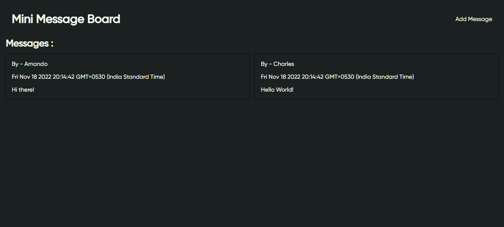

# Mini Message Board

A simple express website where users can add messages and read them

# Demo




# Installation

```
$ npm install
```

# Start Development

MacOs or Linux

```
$ DEBUG=yourreponame:* npm run devstart
```

Windows CMD

```
> set DEBUG=yourreponame:* & npm run devstart
```

Windows Powershell

```
PS> $env:DEBUG='yourreponame:*'; npm run devstart
```
